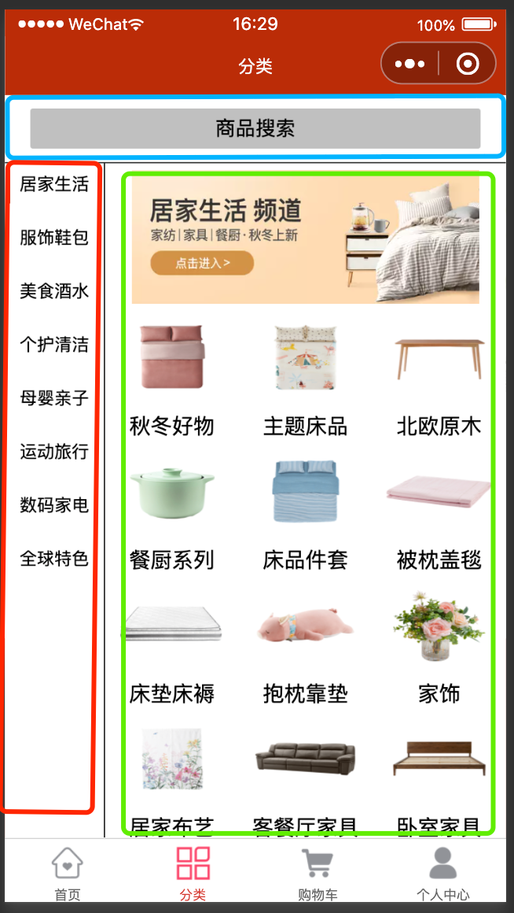
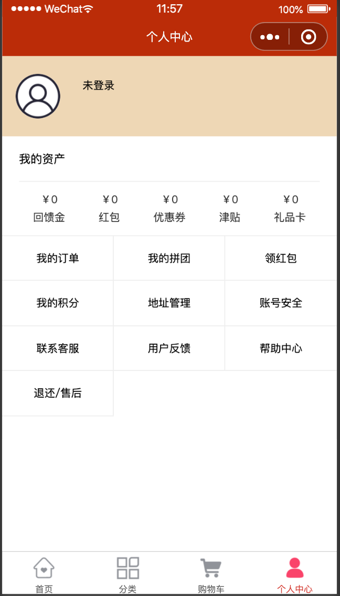
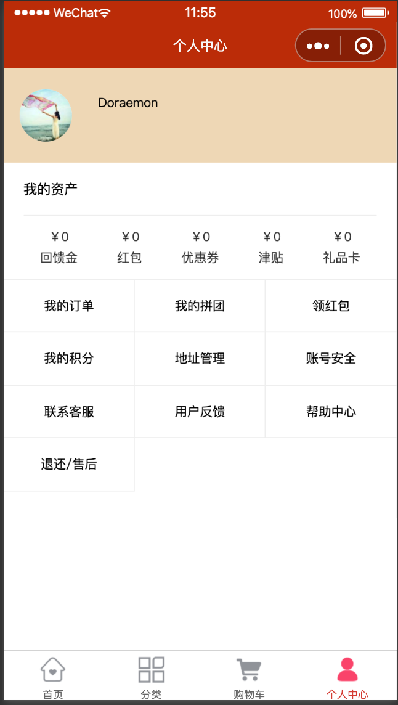
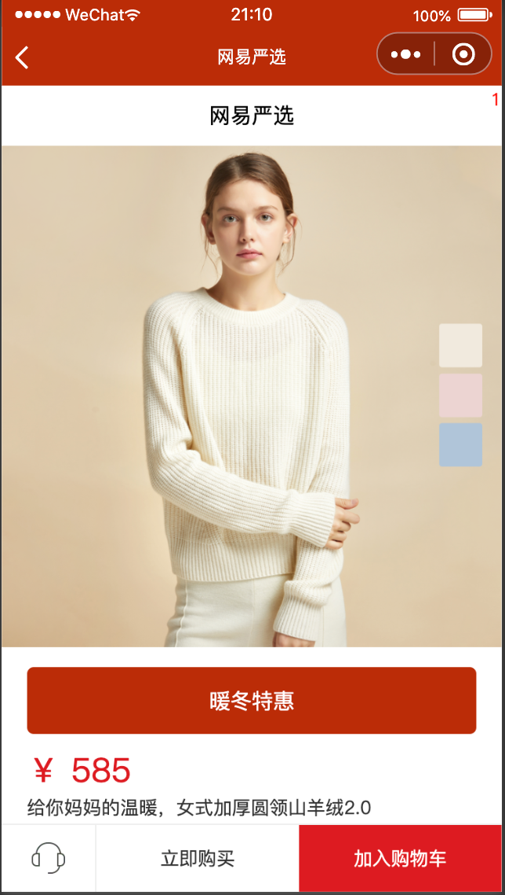

                                                        

## 一、分类页面

包含：搜索、左侧选项卡、后侧内容区

数据：categoryDatas.json

### 1.1 效果图

 


### 1.2 结构

```html
<template>
	<view class="categoryContainer">
		<!-- 头部区域 -->
		<view class="header">
			<view class="search">
				商品搜索
			</view>
		</view>
		
		<!-- 内容区域 -->
		<view class="contentContainer">
			<!-- 左侧区域 -->
			<view class="left">
				<scroll-view scroll-y="true" class="navScroll">
					<view class="navItem" :class="{active:navIndex===index}" @click="changeIndex(index)" v-for="(item,index) in categoryList" :key='item.id' >
						{{item.name}}
					</view>
					
				</scroll-view>
			</view>
			<!-- 右侧区域 -->
			<view class="right">
				<scroll-view scroll-y="true" class="cateScroll">
					<view>
						<!-- 大图 -->
						<image class="cateImg" :src="categoryObj.imgUrl" ></image>
						<!-- 列表 -->
						<view class="goodsList">
							<view class="goodsItem" v-for='item in categoryObj.subCateList' :key='item.id'>
								<image class="goodsImg" :src="item.wapBannerUrl"></image>
								<text class="goodsItem">{{item.name}}</text>			
							</view>
						</view>
					</view>
				</scroll-view>
			</view>
		</view>
		
		
	</view>
</template>
```


```js
import request from '../../utils/request.js'
	export default {
		data() {
			return {
				categoryList:[], //分类页数据
				navIndex:0
			};
		},
		mounted() {
			this.getCategoryData();
		},
		computed:{
			// 需要根据数组，下标得到对象，所以用计算属性
			categoryObj(){
				return this.categoryList[this.navIndex];
			}
		},
		methods:{
			async getCategoryData(){
				this.categoryList=await request('/categoryData');
			},
			// 点击设置下标，高亮
			changeIndex(index){
				this.navIndex=index;
			}
		}
	}
```


## 二、个人中心

### 2.1 效果图

未登录状态：




登录状态：



### 2.2 布局

```vue
<template>
	<div>
		<div class="header">
			<template v-if="userInfo.nickName">
				
				<view>{{ userInfo.nickName }}</view>
				<button @click="exit">退出登陆</button>
			</template>
			<template v-else>
				
				<text class="userInfo" @click="toLogin">去登录吧</text>
			</template>
		</div>
		
		<div class="content">
			<h2>我的资产</h2>
			<p class='line'></p>
			<div class="myAssetList">
				<div class='assetItem'>
					<span>￥0</span>
					<span>回馈金</span>
				</div>
				<div class='assetItem'>
					<span>￥0</span>
					<span>红包</span>
				</div>
				<div class='assetItem'>
					<span>￥0</span>
					<span>优惠券</span>
				</div>
				<div class='assetItem'>
					<span>￥0</span>
					<span>津贴</span>
				</div>
				<div class='assetItem'>
					<span>￥0</span>
					<span>礼品卡</span>
				</div>
			</div>
			<!-- 列表选项 -->
			<div class="personalList">
				<div class="navItem" v-for='(item, index) in personalList' :key='index'>
					<i class='iconfont ' :class='item.icon'></i>
					<p>{{item.name}}</p>
				</div>
			</div>
		</div>
	</div>
</template>
```

background #EED7B5


```js
<script>
	import request from '../../utils/request.js'
	module.exports = {
		data(){
			return {
				userInfo: {
					
				},
				personalList: [
					{
						name: '我的订单',
						icon: 'icon-dingdan11'
					},
					{
						name: '我的拼团',
						icon: 'icon-pintuandingdan'
					},
					{
						name: '领红包',
						icon: 'icon-tubiaolunkuo-1'
					},
					{
						name: '我的积分',
						icon: 'icon-jifen3'
					},
					{
						name: '地址管理',
						icon: 'icon-dizhiguanli'
					},
					{
						name: '账号安全',
						icon: 'icon-dingdan11'
					},
					{
						name: '联系客服',
						icon: 'icon-zhanghaoanquan'
					},
					{
						name: '用户反馈',
						icon: 'icon-tubiaolunkuo-'
					},
					{
						name: '帮助中心',
						icon: 'icon-bangzhuzhongxin'
					},
					{
						name: '退还/售后',
						icon: 'icon-shouhou'
					}
				]
			}
		},
		mounted(){
			wx.getStorage({
                //获取本地缓存
                key: 'userInfo',
                success: res => {
                    console.log('userInfo=====', res);
                    if (res.data) {
                        this.userInfo = JSON.parse(res.data);
                    }
                }
            });
			
			
		},
		methods: {
			toLogin() {
                // 去登陆页面
                wx.navigateTo({
                    url: '/pages/login/login'
                });
            },
            exit() {
                wx.setStorage({
                    key: 'userInfo',
                    data: ''
                });
                // 去登陆页面;把其他页面关掉
                wx.reLaunch({
                    url: '/pages/login/login'
                });
            }
		},
	}
</script>
```


```stylus
.header
		height 200upx
		line-height: 200upx
		background-color #EED7B5
		display: flex
		align-items: center
		.user-img
			margin: 40upx 
			width 100upx
			height 100upx
			border-radius 50%
```


## 三、登录

### 效果图

```vue
<template>
	<view class="loginContainer">
		<image class="logo" src="http://yanxuan.nosdn.127.net/39c5e4583753d4c3cb868a64c2c109ea.png" mode=""></image>
		<p class='text'>网易自营，精品生活家居品牌</p>
		<div class="loginMethods">
			<button class="login wechatLogin" open-type="getUserInfo" @getuserinfo='handleGetUserInfo'>
				微信登录
			</button>
		</div>
	</view>
</template>
```


```js
methods: {
    getUserProfile() {
        // 获取用户信息
        wx.getUserProfile({
            desc: '用于完善会员资料', // 声明获取用户个人信息后的用途，后续会展示在弹窗中，请谨慎填写
            success: res => {
                console.log(res);
                console.log(res.userInfo.avatarUrl); //获取用户微信头像
                console.log(res.userInfo.nickName); //获取用户微信名

                // 用户授权
                wx.setStorage({
                    key: 'userInfo',
                    data: JSON.stringify(res.userInfo)
                });
                // 把其他页面关掉，跳转的某个页面
                wx.reLaunch({
                    url: '/pages/personal/personal'
                });
            }
        });
    }
}
```


## 四、详情页

### 效果图



pages 下新建detail 页面

从 组件 CateList.vue 分类列表页跳转到商品详情页


正式环境：从列表到详情页，传递商品id,，然后根据商品id 去查询商品详情，渲染


### 结构

```vue
<view class="detailContainer">
    <view class="header">
        <icon class="iconfont icon-shouye2"></icon>
        <text>网易严选 </text>
        <view class="shopCart" >
            <icon class="iconfont icon-gouwuche2"></icon>
            <text class="count">1</text>
        </view>
    </view>

    <!-- 内容区 -->
    <scroll-view class="content" scroll-y="true">
        <image class="detailImg" :src="shopDetail.listPicUrl" mode=""></image>
        <view class="tag">{{shopDetail.promTag}}</view>
        <text class="price">￥ {{shopDetail.retailPrice}}</text>
        <view class="info">{{shopDetail.name}}</view>


        <!-- 准备内容 -->
        <view class="list" style="margin-left: 5%;font-size: 28upx;line-height: 50upx;">
            <view>1) 100%桑蚕丝填充，丝丝精粹不掺杂</view>
            <view>2) 创新井字拉网工艺，桑蚕丝不易黏连结块</view>
            <view>3) 两种面料可选，贡缎手感细腻，竹棉清爽透气</view>
            <view>4) AB双面设计，多种活性印花不易褪色</view>
        </view>
    </scroll-view>

    <!-- 底部导航 -->
    <view class="detailFooter">
        <image class="service" src="http://yanxuan-static.nosdn.127.net/hxm/yanxuan-wap/p/20161201/style/img/icon-normal/detail-kefu-d10f0489d2.png?imageView&type=webp" mode=""></image>
        <view class="btn buyNow">立即购买</view>
        <view  class="btn addShopCart" @click="addCart">加入购物车</view>
    </view>
</view>
```


```js
import {mapMutations} from "vuex"
	export default {
		data() {
			return {
				shopDetail: {}
			}
		},
		onLoad(options) {
			// 接受参数
			this.shopDetail=JSON.parse(options.goodsItem);
			// console.log(JSON.parse(options.goodsItem))
		},
		methods:{
			...mapMutations({
				addGoodsItemMutatation:'addGoodsItemMutatation'
			}),
			addCart(){
				// 添加的是整个商品，到state当中
				this.addGoodsItemMutatation(this.shopDetail);
				// wx.reLaunch({
				// 	url:'../cart/cart'
				// })
			}
		}
		
	}
```


```js
 @click="toDetail(item)"

,
		// 跳转至详情页面
		toDetail(goodsItem){
			wx.navigateTo({
				url:'/pages/detail/detail?goodsItem='+JSON.stringify(goodsItem)
			})
		}
```

