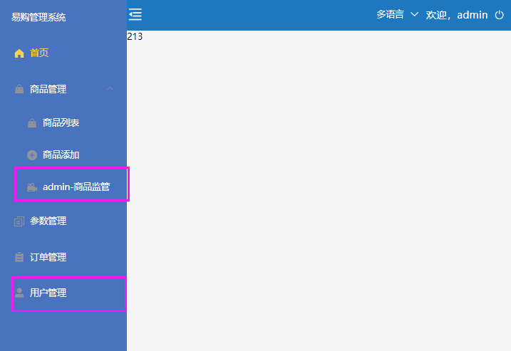
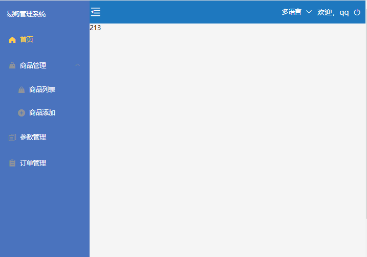

# Vue 用户权限管理

**主要内容**

* 路由配置
* 登录实现
* 动态路由数据
* 动态路由渲染

**学习目标**

 知识点| 要求 
 -| :- 
 路由配置 | 掌握 
 登录实现 | 掌握 
 动态路由数据 | 掌握 
 动态路由渲染 | 掌握 

### 说明

后台管理系统中，权限管理是非常重要的。在前后端不分离时，权限管理都是后台来做的。如今，在前后端分离的情况下，尤其是用了Vue，React 这一类的框架，就需要在前台来控制权限，当然数据还是由后台返回。


## 一、界面效果图

#### 管理员身份：




#### 普通用户身份：




#### 实现思路：

1. 前端配置基础路由（menuList.js）和完整路由（menuList.js）
2. 后台根据用户身份不同，返回不同菜单数据（admin_permission.json、vip_permission.json）
3. 权限对比：前端的全部路由 & 请求动态路由   对比结果作为当前路由配置规则


## 二、步骤：

### 1、基础路由

#### router/index.js：

```js
//基础路由
export const baseRoutes = [
  {
    path: '',
    name: 'Layout',
    component: Layout,
    // 路由元信息  只要给父路由配置，会拦截下面所有的组件
    meta: {
      isLogin: true
    },
    children: [
      {
        path: '/',
        name: 'Home',
        component: Home,
        meta: {
          icon: 'icon-home',
          name: '首页'
        }
      }
    ]
  },
]

//登录
export const routes = [
  {
    path: '/login',
    name: 'Login',
    component: Login
  }
]
```


### 2、前端：定义完整菜单

#### router/menuList.js：

```js

const Goods = () => import('@/views/Goods/Goods.vue')
const GoodsList = () => import('@/views/Goods/GoodsList.vue')
const GoodsAdd = () => import('@/views/Goods/GoodsAdd.vue')
const GoodsWatch=()=>import("@/views/Goods/GoodsWatch.vue")
const Parmas = () => import('@/views/Pramas')
const Order = () => import('@/views/Order')
const User = () => import('@/views/User')


//菜单导航
export const menuList = [
    {
        path: '/goods',
        name: 'Goods',
        component: Goods,
        meta: {
            name: '商品管理',
            icon: 'el-icon-s-goods'
        },
        children: [{
            path: '/goods/goods-list',
            name: 'GoodsList',
            component: GoodsList,
            meta: {
                name: '商品列表',
                icon: 'el-icon-s-goods'
            }
        },
        {
            path: '/goods/goods-add',
            name: 'GoodsAdd',
            component: GoodsAdd,
            meta: {
                name: '商品添加',
                icon: 'el-icon-circle-plus'
            }
        },{
            path:'/goods-watch',
            name:'GoodsWatch',
            component:GoodsWatch,
            meta:{
                name: "admin-商品监管",
                icon:'el-icon-video-camera-solid',
            }
        }
        ]
    },
    {
        path: '/params',
        name: 'Parmas',
        component: Parmas,
        meta: {
            name: '参数管理',
            icon: 'el-icon-document-copy'
        }
    },
    {
        path: '/order',
        name: 'Order',
        component: Order,
        meta: {
            name: '订单管理',
            icon: 'el-icon-s-order'
        }
    },{
        path:'/user',
        name:User,
        component:User,
        meta:{
            name:'用户管理',
            icon:'el-icon-user-solid'
        }
    }


]
```


### 3、路由拦截

```js
import router from './index'
import store from '@/store/index'

// 路由拦截
router.beforeEach((to, from, next) => {
    console.log(!to.matched.some(item => item.meta.isLogin));
    // if (to.meta.isLogin) { //需要登陆才能进入
    // to.matched 当前路由和父路由 [].some  只要有一个符合条件，及返回true
    if (to.matched.length > 0 && !to.matched.some(item => item.meta.isLogin)) {
        // 不需要登陆，直接放行
        next();
    } else {
        // 再判断是否有登陆信息, 从vuex 读取
        let token = store.state.userModule.userinfo.token;
        console.log(token);
        
        if (token) { //已经登陆
            // +++++++++++++++++++++++++
            
            // 放行之前，请求权限  获取动态导航
            if (store.state.menuModule.dyMenuList.length === 0) {
                // 获取动态导航
                console.log('获取动态导航');
                store.dispatch('menuModule/getMenuList')
            }
            // +++++++++++++++++++++++++
            next();
        } else { //没登陆
            next('/login')
        }
    }

})
```


### 4、后端：添加权限控制接口

#### router/index.js:

```js
const adminPermission = require('../data/admin_permission.json')
const vipPermission = require('../data/vip_permission.json')


// 用户权限数据接口
router.get('/permission', (req, res) => {
    // const user = url.parse(req.url, true).query.user;
    const username = req.query.username;
    console.log(username);
    if (username === 'admin') {
        res.send(adminPermission)
    } else {
        res.send(vipPermission)
    }
})
```


### 5、添加权限文件

##### admin_permission.json:

```js
{
    "code": 0,
    "message": "获取【管理员】权限成功",
    "data": [
        {
            "name": "商品管理",
            "children": [
                {
                    "name": "商品列表"
                },
                {
                    "name": "商品添加"
                },
                {
                    "name": "admin-商品监管"
                }
            ]
        },
        {
            "name": "参数管理"
        },{
            "name":"订单管理"
        },{
            "name":"用户管理"
        }
    ]
}
```

#### vip_permission.json:

```js
{
    "code": 0,
    "message": "获取【Vip】权限成功",
    "data": [
        {
            "name": "商品管理",
            "children": [
                {
                    "name": "商品列表"
                },
                {
                    "name": "商品添加"
                }
            ]
        },
        {
            "name": "参数管理"
        },
        {
            "name": "订单管理"
        }
    ]
}
```

#### router/index.js:

```js
// 用户权限数据接口
router.get('/permission', (req, res) => {
    const user = url.parse(req.url, true).query.user;
    // const token = req.query.token;
    if (user === 'admin') {
        res.send(adminPermission)
    } else {
        res.send(vipPermission)
    }
})
```


### 6、前端发请求，菜单信息存到Vuex：

```js
permission:'/foo/permission',//权限

/**
 * 获取用户权限
 * @returns {user:store.state.loginModule.userame
 */
 export const getPermission=(params)=>req.get(base.permission,{params})
```


菜单信息存到Vuex

#### menuModule.js:

```js
import { getPermission } from '../../api/index'
//引入前端导航 
import { menuList } from '../../router/menuList'
//引入比对函数方法
import { compareMenu } from '../../utils/compareMenu'
//导入路由 基础路由
import router, { baseRoutes } from '../../router/index'

export default {
    namespaced: true,
    state: {
        dyMenuList: [],//动态导航容器 
    },
    mutations: {
        //设置导航
        setMenuList(state, payload) {
            state.dyMenuList = payload
        },
        //清空导航
        deleteMenuList(state) {
            state.dyMenuList = []
        },
    },
    actions: {
        //请求动态导航--- 
        // 1)跟前端完整菜单对比 
        // 2）将比较后的菜单加到基础路由Layout[]里
        // 3）将合并之后的菜单存到Vuex里
        getMenuList({ commit, state, rootState }) {
            // 访问其他模块loginModule下的状态
            console.log( rootState.loginModule.token);
            const res = getPermission({
                username: rootState.loginModule.username
            }).then(res => {
                if (res.code == 0) {
                    console.log('后台的导航菜单：', res.data);
                    console.log('前台的导航菜单：', menuList);
                    //导航进行比较 （前端全部的，动态获取的）
                    const list = compareMenu(menuList, res.data)
                    console.log('导航进行比较后：', list);

                    //获取路由的基础的路由
                    console.log('基础路由', baseRoutes);
                    //合并数据
                    let routes = JSON.parse(JSON.stringify(baseRoutes[0].children));//[{home},{订单}]

                    //合并数组
                    routes.push(...list)
                    console.log('合并数组', routes);

                    //动态导航
                    commit('setMenuList', routes);//vuex存储
                   
                    //路由添加
                    router.addRoutes(baseRoutes)
                    console.log(router);

                }
            })
        }
    }
}
```


#### 对比菜单方法：

##### utils/compareMenu.js:

```js
/**
 * 定义匹配规则
 * @param Array {前端配置好的完整路由权限json} menuList 
 * @param Array {后台动态返回的路由权限数据} dyMenuList 
 * @returns 过滤之后符合条件的路由
 */
 export function compareMenu(menuList, dyMenuList) {
    //[{1,2,3},{1,2}] [{1,2},{1,2}]  前端：[{1,2},{1,2}] 
    const arr = JSON.parse(JSON.stringify(menuList))
    // console.log('-----------',menuList, dyMenuList);
    const menu = [];//合格的导航
    arr.forEach((item, index) => {
        dyMenuList.forEach((ele, i) => {
            //判断前端的导航item.meta.name == 后台的 ele.name 
            if (item.meta.name === ele.name) {
                // menu.push(item)
                //注意：判断里面是否包含children =[] 
                if (ele.children && ele.children.length > 0) {
                    //继续比较
                    item.children = compareMenu(item.children, ele.children)
                }
                //添加数组
                menu.push(item)
            }
        })

    });
    // console.log(menu);
    //返回
    return menu;

}
```


