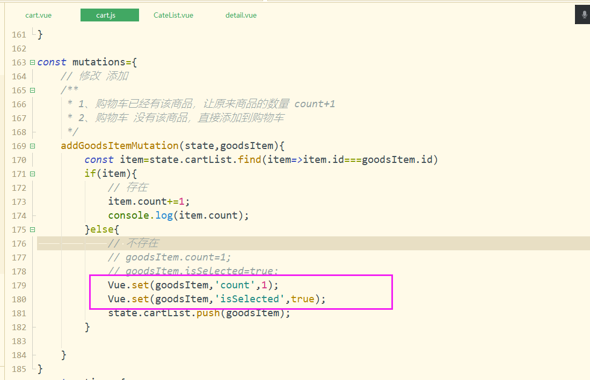
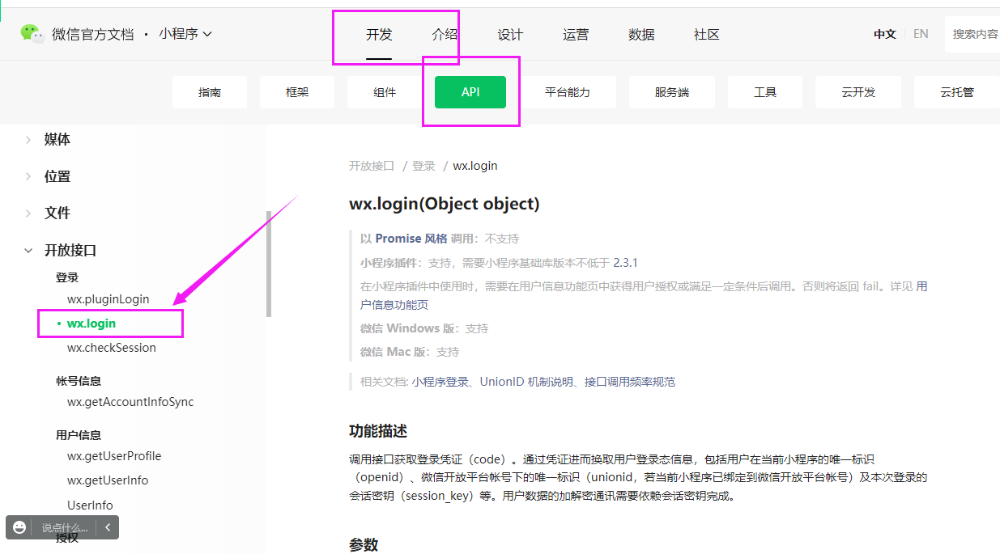
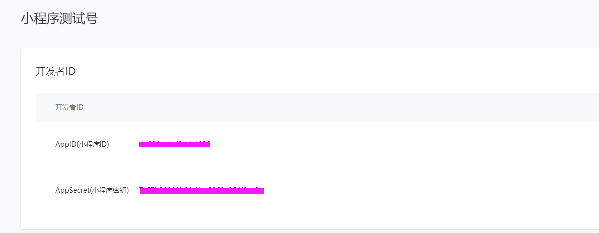
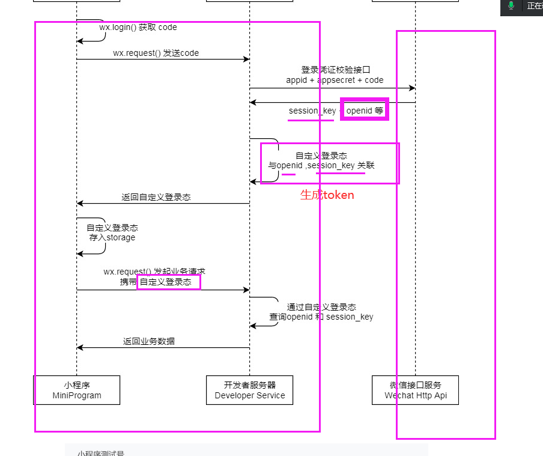
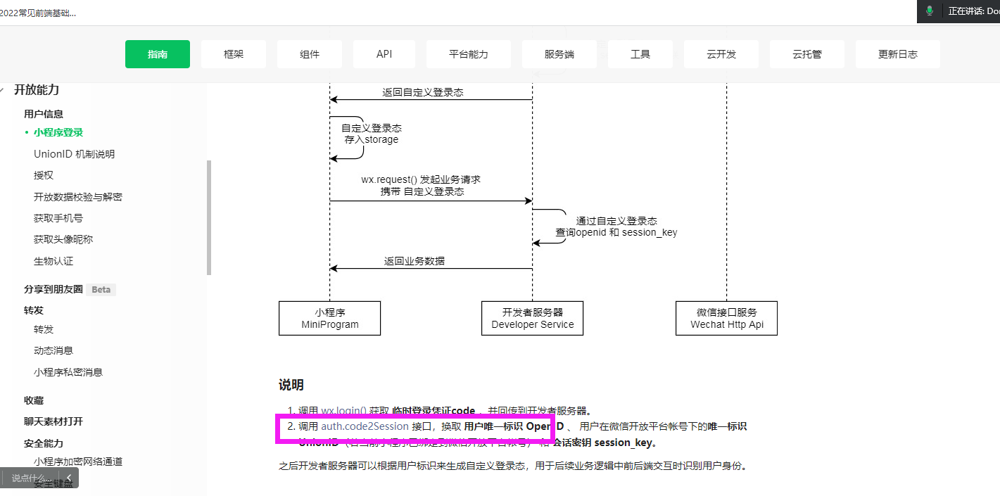
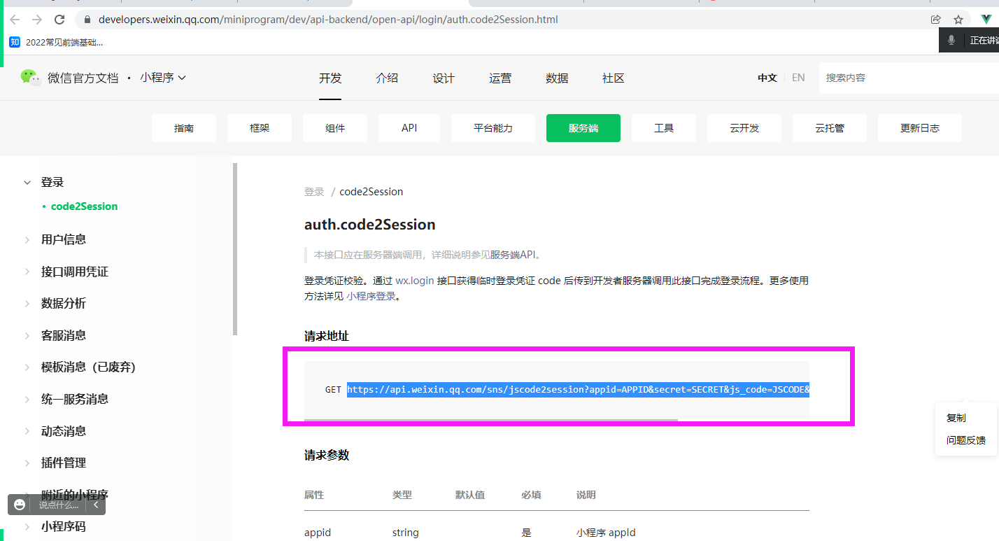

## 一、购物车

### 1.1 效果图


针对  商品数量、选中状态 不是本身就加在商品对象中的，而是当商品加到购物车之后，再添加这两个字段。


Object.defineProperty()


==问题：点击多次加入购物车，到购物车后，商品数量并没有发生变化？==

数据变了，界面也跟着变===》响应式

不是响应式

缺点：Vue：后添加的属性不是响应式

响应式

1. 数据变了，界面也跟着变
2. 组件实例化的时候，已经存在的数据（data,state,computed,props）都是响应式


非响应式

1. 数据变了，界面也不跟着变
2. 组件实例化的时候没有的数据，即后添加的数据都不是响应式


#### 如何变成响应式

this.$set(obj,'name','张三')

1、[Vue.set( target, propertyName/index, value )](https://cn.vuejs.org/v2/api/#Vue-set)

2、this.$set( target, propertyName/index, value )   vm    Vue




#### 反选

全选按钮的状态是由所有商品的选中状态决定的。所有商品都选中，全选选中；只要有一个没选中，全选就不选中。

每个商品的选中状态，Vuex 

every：  全为真，则为真

```js
[].every(item=>item.isSelected==true)
```

依赖于   ==》计算属性


```js
const getters = {
	// 所有商品是否全选中  
	// 全为真，则为真；只要有一个是false,就为false  =>every item=>item.isSelected==true
	isAllSelected(state){
		return state.cartList.every(item=>item.isSelected)
	}

}
```


#### 全选、全不选

点击下面全选按钮时，所有商品的选中状态

==》全选按钮  true  --》下面所有商品都选中

全选按钮  false--》下面所有商品 都不选中


```js
/**
	 * 修改所有商品的选中状态
	 * 
	 */
changeAllSelectMutation(state,isAllSelected){
    // 让所有商品的选中状态，跟全选按钮保持一致
    state.cartList.forEach(item=>item.isSelected=isAllSelected)
}

```


cart.vue

```js
// 全选和全不选
changeAllSelected(isAllSelected){
    this.changeAllSelectMutation(isAllSelected)
}
```


#### 总数量、总价格

```js
// let sum=0;
// let arr=[1,2,3,4]
// for(let i=0;i<arr.length;i++){
// 	sum+=arr[i];  //0+1+2+3+4
// }

// sum 
// 多个出一个
arr.reduce((pre,item)=>{
    return pre+=item   // pre=pre+item  10+1+2+3+4
},10)


```


```js
const getters = {
	
	// 总数量
	totalCount(state) {
		return state.cartList.reduce((pre, item) => {
			return pre += item.isSelected? item.count:0
		}, 0)
	},
	// 总价格 ： 商品单价*商品数量
	totalPrice(state){
		return state.cartList.reduce((pre,item)=>{
			return pre+=item.isSelected?item.retailPrice*item.count:0
		},0)
	}

}
```


```js
...mapGetters('cart',['isAllSelected','totalCount','totalPrice'])
```


```vue
<view class="cartContainer">
		<view class="title">购物车</view>
				<!-- 购物车列表 -->
		<view class="cartList">
			<view class="cartItem" v-for="(item,index) in cartList" :key='item.id'>
				<!-- selected类的显示和隐藏 控制选中、不选中-->
				<text class='iconfont icon-xuanzhong' :class="{selected:item.isSelected}" @click="changeSelected(!item.isSelected,index)"></text>
				<view class="shopItem">
					<image class="shopImg" :src="item.listPicUrl" mode=""></image>
					<view class="shopInfo">
						<text>{{item.name}}</text>
						<text class="price">￥{{item.retailPrice}}</text>
					</view>
				</view>
				<!-- 控制数量 -->
				<view class="countCtrl">
					<text class="del" @click="changeCount(false,index)"> - </text>
					<text class="count"> {{item.count}} </text>
					<text class="add" @click="changeCount(true,index)"> + </text>
				</view>
			</view>
		</view>
		<!-- 底部下单 -->
		<view class="cartFooter">
			<text class='iconfont icon-xuanzhong' :class="{selected:isAllSelected}" @click="changeAllSelect(!isAllSelected)"></text>
			<text class="allSelected">已选 {{totalCount}}</text>
			<view class="right">
				<text class="totalPrice">合计: ￥{{totalPrice}}</text>
				<text class="preOrder">下单</text>
			</view>
		</view>

	</view>
```


购物车的数据需要全局共享，放到Vuex中管理。

### 2.2 动态加载列表数据

```js
import { mapState,mapMutations,mapGetters} from 'vuex'
	export default {
		data() {
			return {
				
			};
		},
		computed:{
			// mapState 参数写成对象，是因为 store对象是采用模块化的方式
			...mapState({
				cartList:state=>state.cart.cartList
			}),
			...mapGetters(['isAllSelected','totalCount','totalPrice'])
		},
		methods:{
			...mapMutations({
				changeCountMutation:'changeCountMutation',
				changeSelectMutation:'changeSelectMutation',
				changeAllSelectMutation:'changeAllSelectMutation'
			}),
			/**
			 * @是添加还是删除 {Boolean} isAdd
			 * @下标 {number} index
			 */
			changeCount(isAdd,index){
				this.changeCountMutation({isAdd,index})
			},
			// 改变商品的选中状态
			changeSelected(isSelected,index){
				this.changeSelectMutation({isSelected,index})
			},
			// 改变全选按钮的状态
			changeAllSelect(isAllSelected){
				this.changeAllSelectMutation(isAllSelected)
			}

		}
	}
```


## 二、登录




### 功能描述

调用接口获取登录凭证（code）。通过凭证进而换取用户登录态信息，包括用户在当前小程序的唯一标识（openid）、微信开放平台帐号下的唯一标识（unionid，若当前小程序已绑定到微信开放平台帐号）及本次登录的会话密钥（session_key）等。用户数据的加解密通讯需要依赖会话密钥完成。


唯一性标识，由谁来提供？===》微信平台


什么时候用唯一标识openid？

支付、存用户的私密数据


怎么获取openid？


小程序可以通过微信官方提供的登录能力方便地获取微信提供的用户身份标识，快速建立小程序内的用户体系。







==客户端步骤：==

1. 从微信服务器获取用户登录凭证code（wx.login()）
2. 将code发送给开发服务器(自己的服务器)

==服务端步骤：==

1. 接收code、整和appId、appSecret对接微信服务器（拼接指定的url）
2. 利用Fly.js库发送请求，返回==openId==
3. 用JWT对用户数据+openid 共同加密生成token
4. 返回token给客户端








### 2.1 用户唯一标识 openid

唯一标识是由微信的服务端颁发的。

#### [wx.login(Object object)](https://developers.weixin.qq.com/miniprogram/dev/api/open-api/login/wx.login.html)

调用接口获取登录凭证（code）。通过凭证进而换取用户登录态信息，包括用户在当前小程序的唯一标识（openid）、微信开放平台帐号下的唯一标识（unionid，若当前小程序已绑定到微信开放平台帐号）及本次登录的会话密钥（session_key）等。用户数据的加解密通讯需要依赖会话密钥完成。更多使用方法详见 [小程序登录](https://developers.weixin.qq.com/miniprogram/dev/framework/open-ability/login.html)。

```js
wx.login({
  success (res) {
    if (res.code) {
      //发起网络请求
      wx.request({
        url: 'https://example.com/onLogin',
        data: {
          code: res.code
        }
      })
    } else {
      console.log('登录失败！' + res.errMsg)
    }
  }
})
```


```js
// 获取用户唯一标识  ：支付、存用户的私密数据
wx.login({
    success: async res => {
        // 1、从微信服务器获取用户登录凭证
        if (res.code) {
            let code = res.code;
            console.log('code:', code);
            // 2、将code发送给开发服务器
            let token = await request('/getOpenId', { code });
            console.log('token：', token);
            // 3、保存token到本地
            wx.setStorageSync('token', token);
        } else {
            console.log('登录失败！' + res.errMsg);
        }
    }
});
```


### aixos:

Axios 不能在小程序里使用，因为：axios是基于浏览器里的window对象进行封装的，它上面有一个XMLhttprequest构造函数，原生的AJAX，去发请求。

而微信小程序的全局对象就是 wx

### 2.2 Fly.js

一个支持所有JavaScript运行环境的基于Promise的、支持请求转发、强大的http请求库。可以让您在多个端上尽可能大限度的实现代码复用。

https://github.com/wendux/fly

安装：npm install flyio

使用：

```js
// Node 入口
var Fly=require("flyio/src/node")
var fly=new Fly;

// 2、整合数据对接微信服务器
const appId='wxXXXXXXXXXXXXX';
const appSecret='xxxxxxxxxxxxxxxxxxxxx';
const url=`https://api.weixin.qq.com/sns/jscode2session?appid=${appId}&secret=${appSecret}&js_code=${code}&grant_type=authorization_code`; 
//发送请求，获取 openId
const res= await fly.get(url);
const openId=JSON.parse(res.data).openid;
```

appId、appSecret

https://mp.weixin.qq.com/wxamp/wadevelopcode/sandbox?token=616528025&lang=zh_CN

### 2.3 jwt加密token

https://github.com/auth0/node-jsonwebtoken

安装：

```bash
npm install jsonwebtoken
```

加密：

```js
var jwt = require('jsonwebtoken');
var token = jwt.sign({ foo: 'bar' }, 'shhhhh');
```

解密：

```js
// verify a token symmetric - synchronous
var decoded = jwt.verify(token, 'shhhhh');
console.log(decoded.foo) // bar
```


### 2.4 完整流程

#### 客户端：

```js
// 获取用户唯一标识
wx.login({
    success: async (res) => {
        // 1、从微信服务器获取用户登录凭证
        let code = res.code;
        console.log(code)
        // 2、将code发送给开发服务器
        let token = await request('/getOpenId', {code});
        console.log(token);
        // 3、保存token到本地
        wx.setStorageSync('token', token)
    }
})
```


#### 服务端：

```js
router.get('/getOpenId', async (req,res)=>{
	// 1、接受请求参数
	const code=req.query.code;
	// 2、整合数据对接微信服务器
	const appId='';
	const appSecret='';
	
	// 请求微信接口 的链接
	const url=`https://api.weixin.qq.com/sns/jscode2session?appid=${appId}&secret=${appSecret}&js_code=${code}&grant_type=authorization_code`; 
	// 对接微信服务器
	const result= await fly.get(url);
	
	const openId=JSON.parse(result.data).openid;
	console.log('openid',openId)
	// 3、接收到微信服务器返回的openId，结合当前用户数据，加密生成token
	const info={
		openId,
		name:'Doraemon',
		age:17
	}
	var token = jwt.sign({ foo: info }, 'shhhhh');
	console.log(token);
	// 解密：
	// const res2=jwt.verify(token,'shhhhh');
	// console.log(res2)
	
	// 4、返回给浏览器当前用户加密后的标识
	res.send({
		token
	})

})
```

